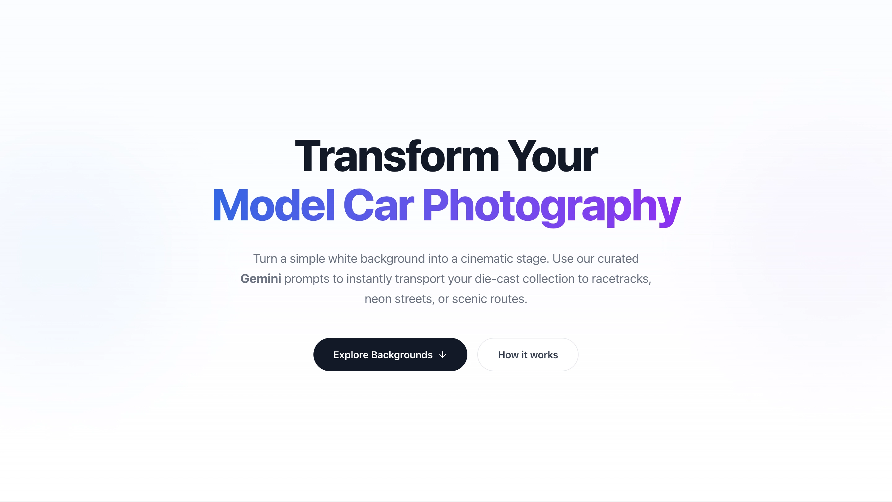

# CarscapeAI Prompts

**CarscapeAI Prompts** is a high-end AI prompt tool specifically designed for automotive photography enthusiasts and creators. Through meticulously tuned instructions, it helps users transform ordinary car photos into cinematic, world-class visual art.




---

## Key Features

-   **Professional-Grade Prompts**: Covers a wide range of realistic styles, including Modern Urban, Race Tracks, Winter Snow, and even Lunar Surface.
-   **Technical Metadata**: Every prompt includes a specific **Camera Angle** recommendation to ensure accurate visual results.
-   **One-Click Copy**: Instantly copy high-quality, tested prompts to use in AI models like Gemini.
-   **Dynamic Filtering**: An intuitive Tag-based filtering system helps you find the perfect inspiration among dozens of scenes.
-   **Optimized for Gemini**: Prompt structures are specifically tuned for Gemini’s image understanding and generation logic, maintaining car details and proportions.

---

## How It Works

1.  **Prepare a Photo**: Take a clear photo of your car (a plain background is recommended).
2.  **Pick a Style**: Browse CarscapeAI and click **Copy** on the style that fits your vision.
3.  **Generate in Gemini**: Upload your photo to [Gemini](https://gemini.google.com/), paste the prompt, and watch the transformation.

---

## Built With

- **React & TypeScript**: Delivering a responsive and type-safe user experience.
- **Tailwind CSS**: Crafted with a modern, high-end aesthetic.
- **Vite**: Optimized for lightning-fast performance and efficient asset handling.

---

## Local Setup

If you wish to run this project locally:

```bash
# 1. Clone the repository
git clone https://github.com/Liwei-Ji/carscapeai-prompts.git

# 2. Enter the directory
cd carscapeai-prompts

# 3. Install dependencies
npm install

# 4. Start the development server
npm run dev
```

---

## Connect

-   **Author**: Liwei
-   **Instagram**: [@64_jpw](https://www.instagram.com/64_jpw/)
